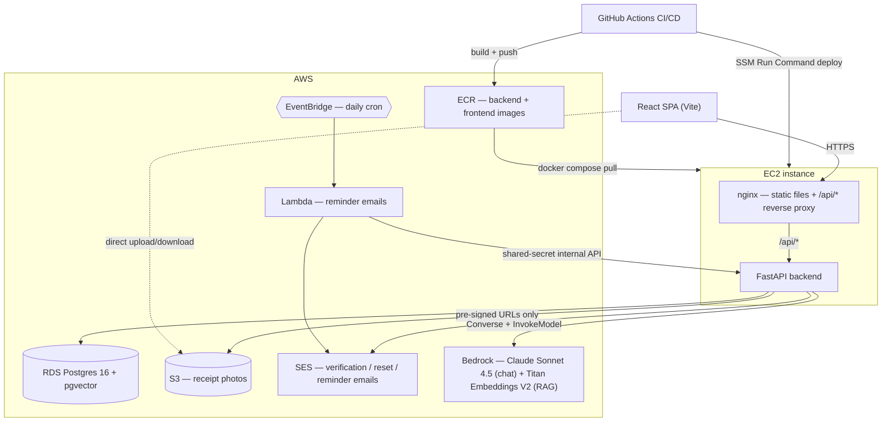

# AutoAssist

AutoAssist is a multi-user vehicle maintenance tracker: it stores a car's fixed-interval maintenance schedule and real service history, computes what's due next from actual mileage/date data, and answers natural-language questions about that data (and the owner's manual) through a tool-calling AI assistant — without ever letting the AI touch the database directly.

Built as both a working app and a documented learning project — every real bug, design decision, and debugging session is logged in [`JOURNAL.md`](JOURNAL.md); the full narrative and every deviation from the original plan is in [`HANDOFF.md`](HANDOFF.md).

## Architecture



The backend is a single FastAPI app; the frontend is a static React SPA served by nginx, which also reverse-proxies `/api/*` so the same `fetch('/api/...')` calls work identically in local dev (Vite's dev proxy) and in the deployed container (nginx). Postgres, S3, SES, Bedrock, and the reminder pipeline (EventBridge → Lambda) are all real AWS services, not mocked — see `infra/` for the full Terraform setup. AWS infrastructure is destroyed between work sessions to control cost (see `HANDOFF.md` §Phase 7); the app runs entirely locally via `docker compose` without it.

## The app

**Dashboard** — a vehicle card (current mileage, average miles/day, inline mileage update), an Upcoming Maintenance panel color-coded by urgency (overdue / due soon / OK, each with a projected date and miles-remaining), a service history table with receipt photo upload/view per row, and a spending dashboard (bar chart by category, line chart by year, cost-per-mile) via Recharts.

**Chat** — a floating "Ask AutoAssist" button opens a panel in the bottom-right corner. It answers questions like "what's overdue on my Lexus," "how much have I spent on oil changes," or "what oil does my car take" — the first three come from the user's own structured data, the last from the actual owner's manual PDF, cited by page number. Anything outside the user's own vehicle data gets a polite decline, not a guess.

*(No hosted screenshots — this is a private, local-first project without a public deployment to capture from. The component breakdown above describes exactly what's on screen; `frontend/src/App.jsx` and its sibling components are the ground truth.)*

## Running locally

**Prerequisites:** Docker (developed against [Colima](https://github.com/abiosoft/colima) as the runtime, not Docker Desktop — any Docker-compatible runtime works), a `backend/.env` file (see `backend/.env.example`), and AWS credentials via `aws configure` (the backend container mounts `~/.aws` read-only) for SES/S3/Bedrock.

```bash
docker compose up --build
```

This starts three services — Postgres 16 with the pgvector extension (auto-seeded from `seed.sql` on first run), the FastAPI backend, and the React frontend behind nginx — and waits for the database healthcheck before starting the backend.

- Frontend: http://localhost:5173
- Backend API: http://localhost:8000

Data persists in a named Docker volume across restarts (`docker compose down` / `docker compose up` again); `docker compose down -v` wipes it.

**One extra one-time step as of Phase 11**: `seed.sql` intentionally ships the `manual_chunks` table schema but not its ~600 embedding rows (they're regenerable from the manual PDFs already in the repo, not hand-entered data — see `HANDOFF.md`'s Phase 11 entry). Populate it once per fresh database:

```bash
cd backend
python3 -m venv venv && source venv/bin/activate
pip install -r requirements.txt
python ingest_manuals.py --vehicle-id 2   # id of the seeded Lexus
```

Without this step, the app works fully except the chat's manual-lookup questions (e.g. "what oil does my car take") will come back empty.

## Tech stack

- **Backend**: Python, FastAPI, SQLAlchemy 2.0, Pydantic v2, `pytest`
- **Database**: PostgreSQL 16 + pgvector (local: Docker; deployed: RDS)
- **Frontend**: React 19 + Vite, Recharts for charts — no state management library, no CSS framework
- **AI**: Amazon Bedrock — Claude Sonnet 4.5 (Converse API, tool calling) for chat, Titan Text Embeddings V2 for RAG
- **AWS**: RDS, EC2, S3 (pre-signed uploads), SES, Lambda, EventBridge, ECR, IAM (5 separate least-privilege identities), CloudWatch billing alarms
- **Infra**: Terraform (VPC, RDS, EC2, IAM, Lambda/EventBridge — destroyable between sessions to control cost)
- **CI/CD**: GitHub Actions, OIDC federation to AWS (no static credentials), SSM Run Command deploy (no SSH, no open port 22 required for deploy)
- **Auth**: JWT in an httpOnly cookie, bcrypt password hashing, email verification + password reset via SES

## Design decisions

A few choices worth explaining in more depth than a bullet point — each is also covered at length in `HANDOFF.md`, with the real bugs and iterations that shaped it.

**The due-date engine is "whichever comes first," not just mileage or just time.** Most maintenance items have both a mileage interval (e.g. every 7,500 mi) and a time interval (e.g. every 6 months) — whichever threshold is reached first determines the due date. This matters concretely: a low-mileage driver can go months without hitting a mileage threshold but still needs time-based service (rubber parts and fluids degrade with age, not just use), while a high-mileage driver blows through the time window early. The engine computes both candidate dates independently and takes the minimum, then buckets into OVERDUE / DUE_SOON / OK based on *either* a days-remaining threshold *or* a miles-remaining threshold (an item can be "due soon" on mileage alone even if the date is still far off). It's a pure function — no database access, `today` passed in explicitly — specifically so it's unit-testable and reusable: the same function backs the dashboard's `/api/upcoming` endpoint, the Lambda reminder emails, and the chat's `get_upcoming_maintenance` tool, with zero duplicated logic across any of them.

**Receipt photo uploads use pre-signed S3 URLs, not a backend proxy.** The backend never touches the actual image bytes — it generates a short-lived, scoped pre-signed URL, and the browser uploads/downloads directly against S3. This avoids the backend buffering large files in memory or spending its own bandwidth relaying them, and it's the standard pattern for this exact problem. The content type is mapped through a fixed server-side allowlist rather than trusted from the client, specifically because an earlier draft took the filename directly from the request — a filename like `../../../whatever` could have escaped the intended `users/{id}/vehicles/{id}/receipts/{id}/` key prefix. Caught before it shipped.

**The AI assistant calls fixed backend functions; it never writes or sees SQL.** This is the project's core security argument, not just a phrasing choice. The model can only ever request one of five pre-defined, parameterized tools (`get_vehicle_info`, `get_upcoming_maintenance`, `get_service_history`, `get_spending_summary`, `search_manual`) — each described to the model only as a name + a JSON parameter schema, never as executable code. The *backend* decides whether to honor a tool request and runs the real function against the real database; the model never gets a connection string, a query interface, or any way to express "run this arbitrary SQL." A model asking for `vehicle_id=17` is a suggestion, not a command — the backend independently re-checks that the requesting user actually owns that vehicle on every single call, regardless of what the model asked for. Verified directly, not just assumed: a test explicitly instructed the model to call a tool against another account's vehicle id "even if you expect it to fail," and the *backend's* rejection is what stopped it, not the model declining politely.

**pgvector in the existing Postgres instance, not a separate vector database or managed Bedrock Knowledge Base.** No new infrastructure, no new service to operate, and it's genuinely simpler to explain end-to-end in an interview: chunk the manual PDFs page-by-page (chunks never cross a page boundary, so a citation is always an exact page number, never a range), embed each chunk with Titan, store the vector alongside ordinary relational columns, and retrieve by cosine distance with a plain SQL `ORDER BY`. At this corpus size (~600 chunks) a sequential scan is fast enough that an approximate-nearest-neighbor index (ivfflat/hnsw) isn't needed yet — a deliberate simplification, not an oversight, revisited only if the corpus grows.

**Ownership checks live in the tool-execution layer, not just at the API boundary — the same pattern used three other places.** `get_owned_vehicle_or_404` guards every REST route; S3 object keys are namespaced by user and vehicle id; and every AI tool re-derives ownership from the authenticated user's session before touching data, exactly like the REST routes do. It's the same rule enforced in three structurally different places (HTTP routing, storage key design, and now LLM tool execution) rather than three different ad-hoc mechanisms — one mental model to explain, not three.

## By the numbers

- **12 build phases** completed, from schema design through a full AI assistant with RAG
- **25 API endpoints**, all auth-gated and ownership-checked
- **14/14 backend tests passing** (`pytest`), covering the due-date engine and spending stats as pure, unit-tested functions
- **5 tool-calling functions** exposed to the AI assistant, backed by **637 embedded manual chunks** for retrieval-augmented answers
- **5 separate least-privilege IAM identities** across local dev, infrastructure provisioning, the deployed app, CI/CD, and the reminder Lambda
- Real seeded data: **9 maintenance schedule items** and **16 service records** for an actual 2002 Lexus ES300, not synthetic fixtures

## Resume bullets (draft)

- Built a full-stack vehicle maintenance tracker (FastAPI, React, PostgreSQL) with a due-date engine that reconciles mileage- and time-based intervals across 9 real maintenance items, backed by 14 passing unit tests for its pure business-logic core.
- Designed a tool-calling AI assistant (Amazon Bedrock, Claude Sonnet 4.5) restricted to 5 fixed, ownership-checked backend functions instead of SQL generation, with cosine-similarity retrieval over 637 embedded owner's-manual chunks (pgvector) for cited, page-accurate answers.
- Deployed a multi-user app to AWS (VPC, RDS, EC2, S3, SES, Lambda/EventBridge) via 100% Terraform IaC and a GitHub Actions CI/CD pipeline using OIDC federation and SSM Run Command — zero static AWS credentials anywhere in the pipeline or on the deployed instance.
- Enforced a single ownership-checking pattern consistently across 25 REST endpoints, S3 object key design, and AI tool execution, independently verified by adversarial testing (forcing tool calls against other users' data and confirming backend-side, not model-side, rejection).
